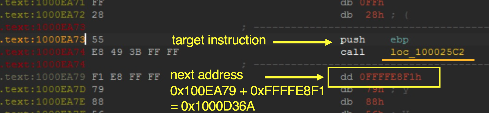
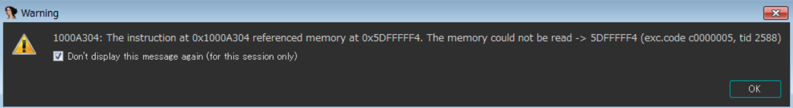
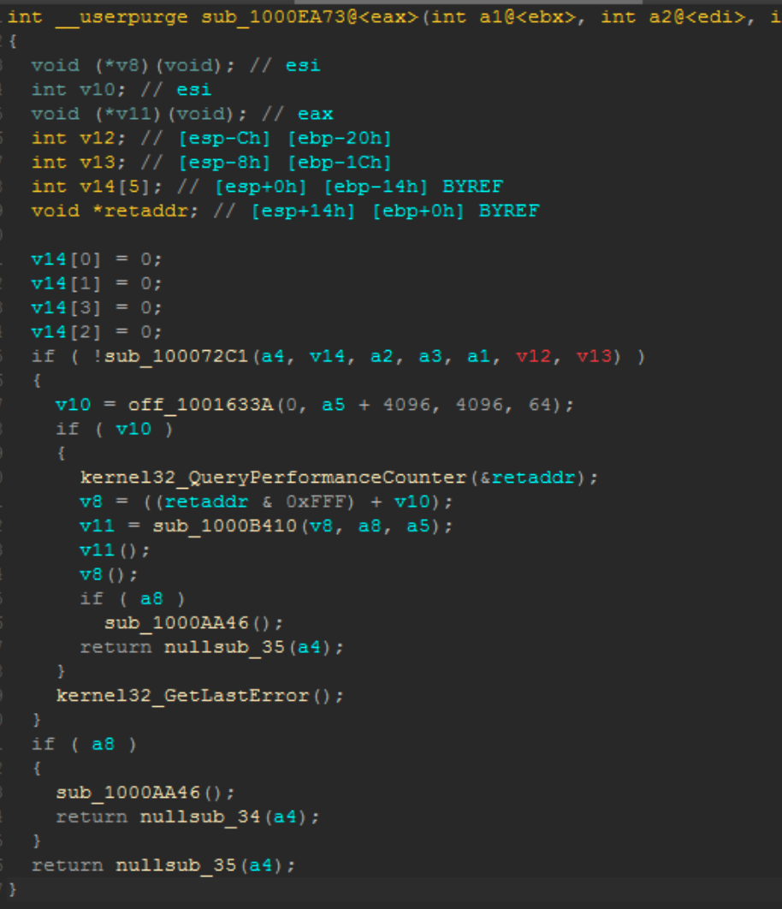

# Code Scattering ShadowPad Analysis
ShadowPad and Its loader started to be obfucated its control flow as the following since 2020.

  

PT security publishes the blog about this type.  
[Higaisa or Winnti? APT41 backdoors, old and new](https://www.ptsecurity.com/ww-en/analytics/pt-esc-threat-intelligence/higaisa-or-winnti-apt-41-backdoors-old-and-new/#id6)  


The scripts in this repository were written to help analysis of "Code scattering" ShadowPad. 

## Sample used to show this use case 
386eb7aa33c76ce671d6685f79512597f1fab28ea46c8ec7d89e58340081e2bd (log.exe)  
5a151aa75fbfc144cb48595a86e7b0ae0ad18d2630192773ff688ae1f42989b7 (log.dll)  
5f1a21940be9f78a5782879ad54600bd67bfcd4d32085db7a3e8a88292db26cc (log.dll.dat)


## Step
Note) The following steps patch the binary and I recommend to apply patches to the input file (Apply patches to input file...) and recreate the idb file in each step. I saw that the patched bytes were not reflected when I patched consecutively in one idb file.  
This analysis approach uses Emulaiton, [Unicorn Engine](https://www.unicorn-engine.org/)

1. Deobfuscate Code Scattering  (01_deobScatter.py)  
Find the address of jump function which obfuscates control flow. It is 0x100025C2 in this case. Set the address in the 01_deobScatter.py. This scripts calculates the target address and changes jmp opcodes.  
2. Nop out opaque predicates (02_deobOpaque.py)  
Search the opaque predicate codes and nop out (0x90). Before running this script, you need to load idaemu.py, which is tweaked from [original one](https://github.com/36hours/idaemu).  
3. Clean Nop out control flow (03_cleanControlFlow.py)  
Calculate the target address and route the control flow to avoid nop out codes.  
```
data:00459C1F E9 85 6D 01 00    jmp     loc_4709A9 <- rewrite target address to 0x44DF1D
data:004709A9 90                nop
data:004709AA 90                nop
data:004709AB 90                nop
data:004709AC 90                nop
data:004709AD 90                nop
data:004709AE 90                nop
data:004709AF E9 F8 38 04 00    jmp     loc_4B42AC
[...]
data:0044DF1D 3B 44 24 28       cmp     eax, [esp+4+arg_20] (target) 
```  
4. API deobfuscation (04_api_resolver.py)
Search API call functions and debug automatically to get the API name with ida_dbg module. 
While runnign the scripts, an access violation dialog box like below pops up and kindly ignore.  
  
Once the script finishes, we need to take memory snapshot of loader segments to refelct the API name.  
This approach consumes time and better approach needs to be considered. 

## Ouput 
We still need to adjust function tails and define API declarations. However we can see clearer decompile view.  

 


