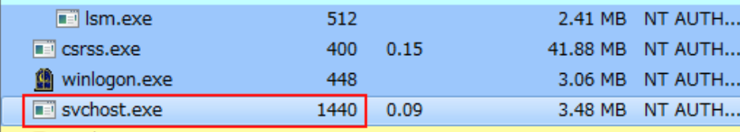
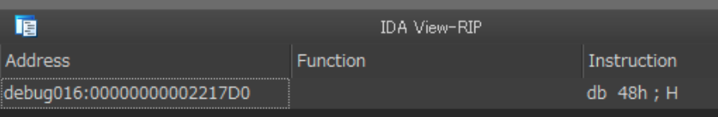
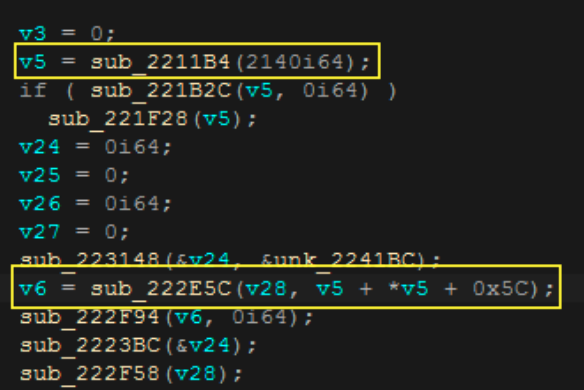
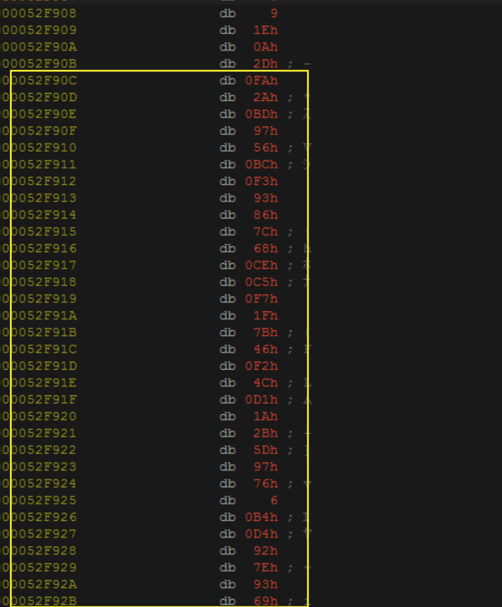
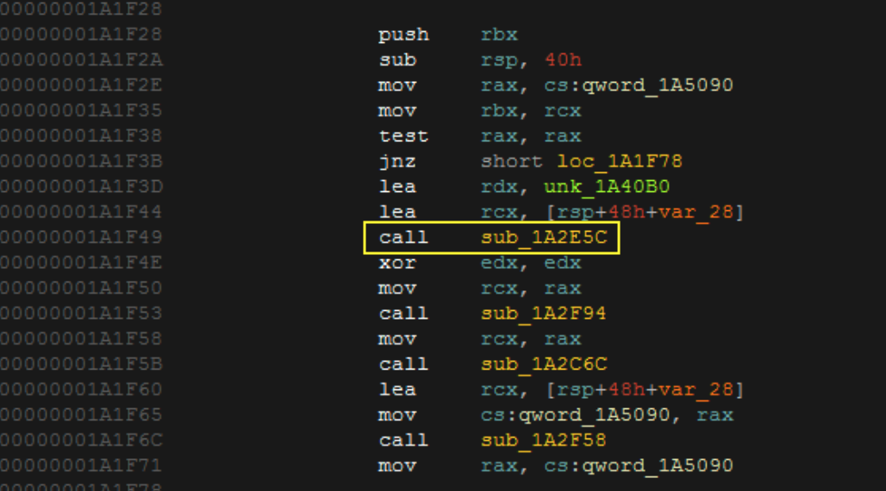
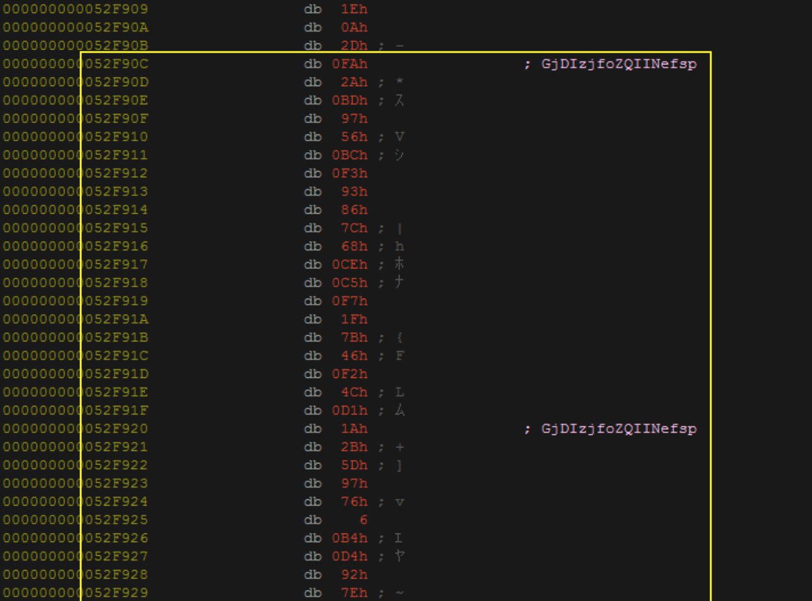
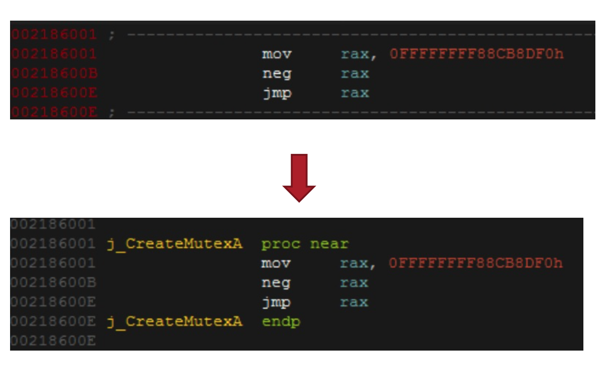
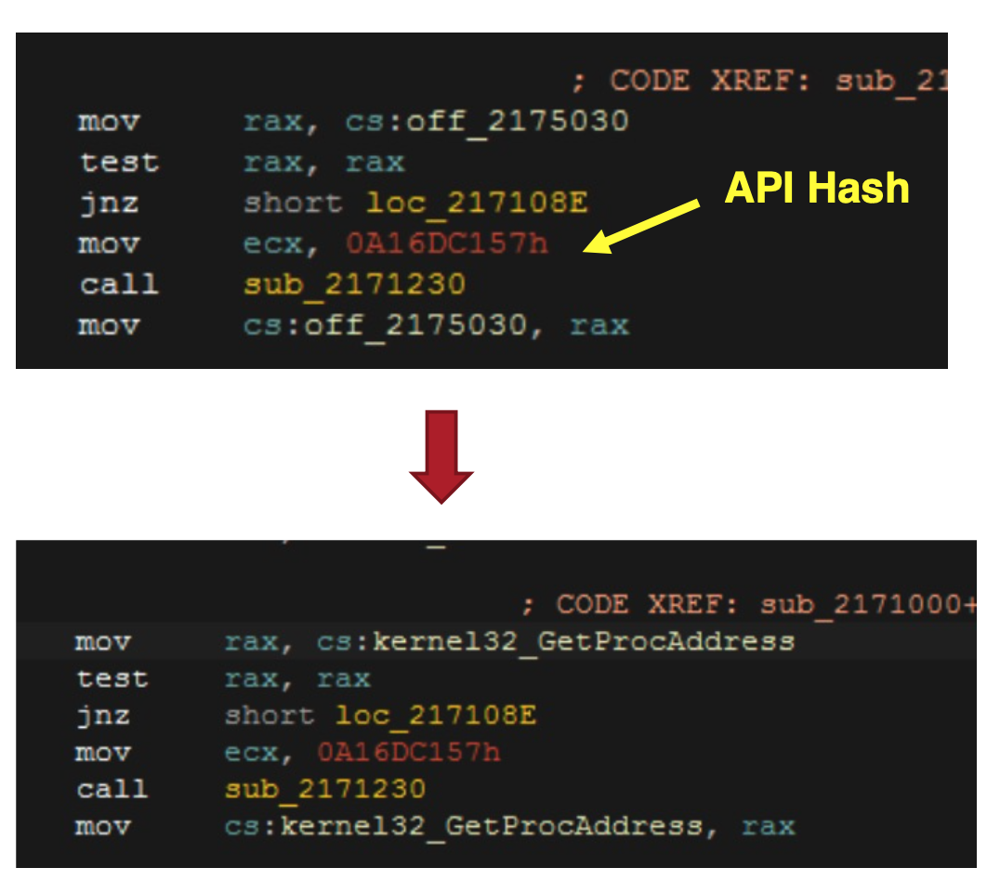

# General ShadowPad Analysis

The scripts in this repository were written to help ShadowPad analysis to get its configuration. 

## Sample used to show this use case 
x64 sample sha256: 8504c06360f82b01b27aa1c484455e8a6ce9c332d38fe841325521d249514bfa  
This is dll and the following legitimate EXE is used for debugging.  
sha256: e5afd28ba78d772da58022ef395e0ad4a948cb8f6decf944e03fb99c2fdc099c

x86 sample sha256: a77b04b1c809c837eafaa44b8457c230fdddd680c88990035439fc9ed2493804  
The follwoing dropper is useful for debugging.  
sha256: e4ac9f5e4ab6b324e4dbb70feff4a17351c29ebce637d39d5a5197f07dd02b18  

## Step

1. Debug and Run the sample by IDA Pro Debugger
2. Wait until plugin modules are decrypted on the memory 
3. If the target injects the code to other process, attach the debugger to the process  
The x64 sample injects the code into svchost.exe  

4. Search config moduel by byte pattern defined in shadowpad-config-module.yara (chunk1 or chunk2 for target CPU architecture)  
In this case, config module is allocated in debug016 memroy segemnt starting from 0x220000 and moduel code starts from 0x221000.
  
Makes codes from 0x221000 in the memory segement.
5. Debug to extract configugration blob
First, I recommend to take a snapshot of VM. I encoutner debugger stop unexpectedly during debugging here. 
The configuration blob is extracted to allcated memory. We can trace it from the search result of Step 4.

  

In this case, sub_2211B4 is wrapper of localalloc and v5(variable5) stores the adddress of new allocated memory. sub_222E5C copies extracted configuration blob to v28. We step over debug from the start of the function to sub_222E5C is called. At this point, v5 + 0x5C points to the configuratoin blob (0x52F90C). 

  

6. Decrypt config
Configuration is encrypted by same algorithm with string encryption. Now we look for string decrypttion funciton. To find string decryption is not difficult. When we scrol up the screen from the address we found Step 4, we can see the the code pattern below. 

  

Passing unknown blob to the string decryption funciton. In this case, it is sub_1A2E5C. We call this function by Appcall, which is IDA Pro feature to decrypt.
Set the cursor at the addresss which is found at Step 5. (0x52FA90C) and Edit the config_decoder.py to set the string decryption function name in it and run the script. We can see the decrypted configuration like the below.

  

## Appcall 
Appcall is one of IDA Pro's features and it enables to call funcitons inside the debugged program. Appcall is used in some scrpts in the repository.
If you want to konwo more about Appcall, the following sites are helpful.
* [Introducing the Appcall feature in IDA Pro 5.6](https://hex-rays.com/blog/introducing-the-appcall-feature-in-ida-pro-5-6/)  
* [Practical Appcall examples](https://hex-rays.com/blog/practical-appcall-examples/)
* [The DGA of Zloader](https://johannesbader.ch/blog/the-dga-of-zloader/)

## Other scripts for Anti-Analysis Techniques
2 scripts to defeat anti-analysis techniqeus for API obfuscation
* jmp_api_resolver.py 
  

* api_resolv-appcall.py

  
